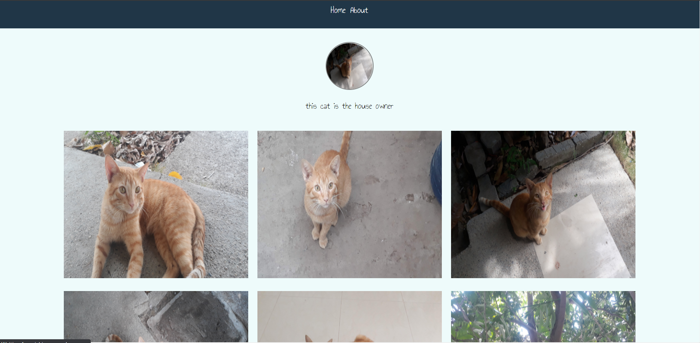
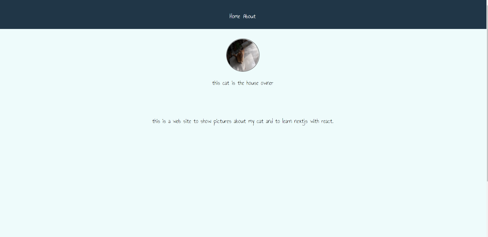
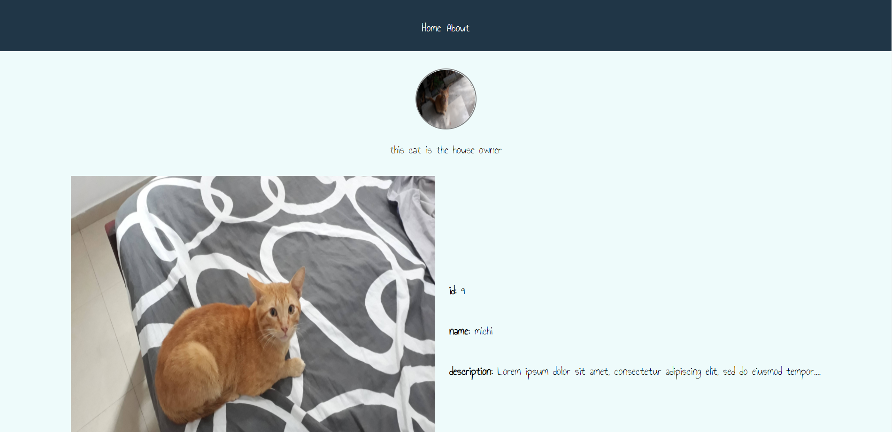

# Michi 

this is a website of photos of my cat called Michi, this was developed by using nextjs and mainly was used to test my skills in reactJs and learning the basics of nextJs. 

the website has two routes: 
* **the home:** which is where the cat photos are displayed. (you can also visit each image by clicking it)
* **about:**  which holds basic info about the project. 

## the following screenshots are from the web site. 
 

### Home 

### About
 

### Sample photo 
 

 you can visit the web site [here](https://michi-nu.vercel.app/)

